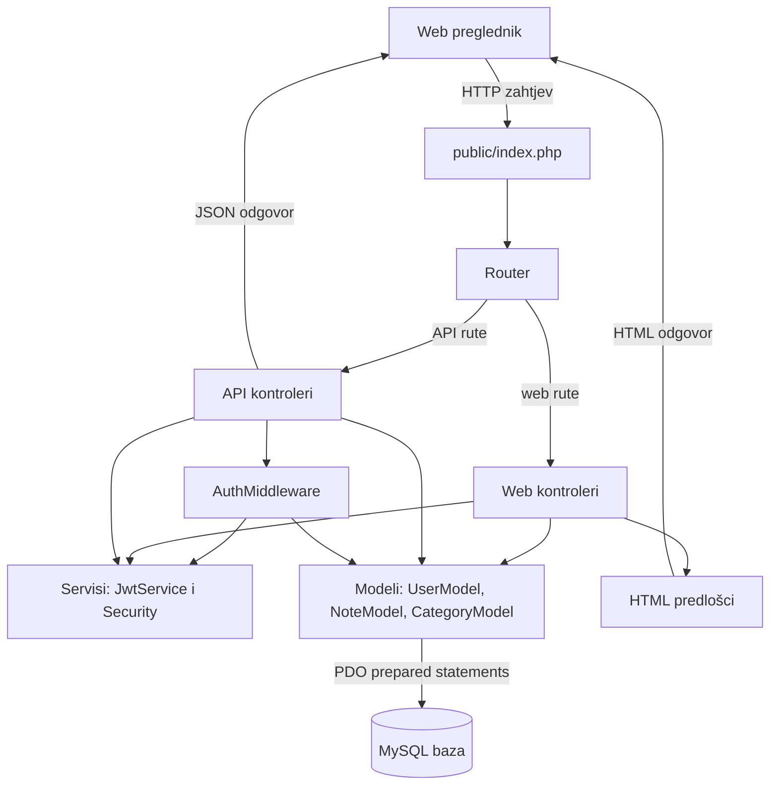

# Dijagram arhitekture - NoteApp

## Slojevi

- `public/index.php` učitava konfiguraciju, postavlja sigurnosna zaglavlja i registrira rute.
- `Router` mapira HTTP metodu i putanju na metodu odgovarajućeg kontrolera.
- Web kontroleri vraćaju HTML predloške iz mape `views`.
- API kontroleri vraćaju JSON odgovore i HTTP statusne kodove.
- `AuthMiddleware` provjerava JWT Bearer token i administratorsku ulogu.
- Modeli rade s MySQL bazom kroz PDO prepared statements.
- `JwtService` i `Security` izdvajaju zajedničku logiku za tokene, CSRF, escaping i sigurnu CSS boju.
