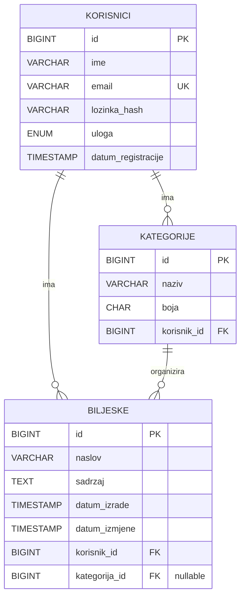

# ER dijagram - NoteApp

## Napomene

- Jedan korisnik može imati više bilješki.
- Jedan korisnik može imati više kategorija.
- Jedna kategorija pripada točno jednom korisniku.
- Bilješka pripada točno jednom korisniku, a kategorija može biti `NULL` ako se kategorija obriše.
